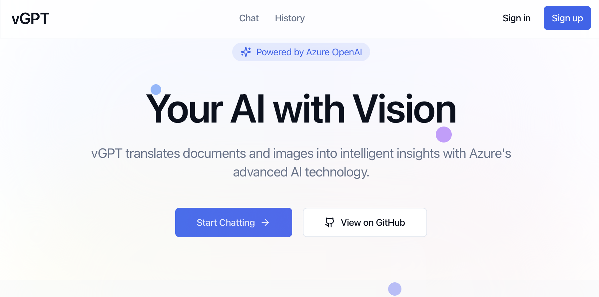

# vGPT - AI Vision & Chat Platform

<div align="center">
  
  
  [Live Demo](https://chat.visionml.tech) | [Report Bug](https://github.com/gopalkumr/vGPT-ocr/issues) | [Request Feature](https://github.com/gopalkumr/vGPT-ocr/issues)
</div>

## 🌟 Overview

vGPT is an advanced AI platform that combines the power of Azure OpenAI with document understanding and OCR capabilities. It provides an intuitive interface for intelligent conversations, document analysis, and image text extraction.

🔗 **Live Demo**: [https://chat.visionml.tech](https://chat.visionml.tech)

## ✨ Features

- **🤖 Azure GPT-3.5 Turbo Integration**: Powered by Azure's advanced AI models for intelligent conversations
- **📄 Document OCR**: Extract and analyze text from PDF documents
- **🖼️ Image Analysis**: Process and extract text from images
- **💬 Chat History**: Secure storage of conversations for registered users
- **🎨 Modern UI**: Clean, responsive design with smooth animations
- **🔒 Secure**: Built with Supabase for robust authentication and data storage

## 🛠️ Tech Stack

- **Frontend**: React, TypeScript, Vite
- **UI Framework**: Tailwind CSS, shadcn/ui
- **AI Services**: Azure OpenAI, Azure Computer Vision
- **Backend & Auth**: Supabase
- **Deployment**: Azure Cloud

## 🚀 Getting Started

### Prerequisites

- Node.js (v16 or higher)
- npm or yarn
- Azure account with OpenAI access
- Supabase account

### Installation

1. Clone the repository:
```bash
git clone https://github.com/gopalkumr/vGPT-ocr.git
cd vGPT-ocr
```
